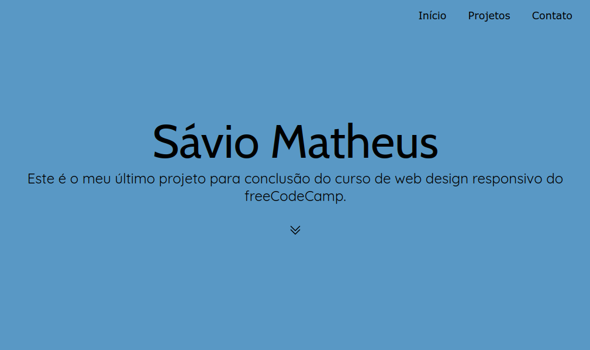

# Curso Web Design Responsivo
Estes são os projetos que fiz para concluir o curso de web design do freeCodeCamp, conforme os entreguei para conseguir o [certificado](https://www.freecodecamp.org/certification/fcc442f5a01-f9d5-4eb1-bd3b-3406ab5c9b81/responsive-web-design).

## Página de homenagem

## Formulário simples

## Apresentação de um produto

## Página de documentação

## Portfólio

